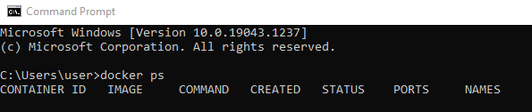
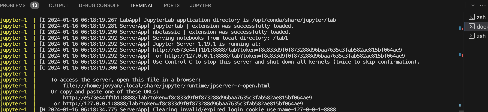

# Getting the lab 1 files

First, you need to install git:
https://github.com/git-guides/install-git

To get the lab1 files, use the following command

```bash
git clone https://github.com/pavitramehra/cs6964_lab1.git
cd cs6964_lab1
```


# What is Docker in simple words?

Docker is an open platform for developing, shipping, and running applications. Docker enables you to separate your applications from your infrastructure so you can deliver software quickly. With Docker, you can manage your infrastructure in the same ways you manage your applications. 

The Docker container will contain all the dependencies and libraries needed for the lab. This will make your life easier as you won't need to install any packages/libraries yourself, you just need to launch the container and everything will be set up for you. 

# Installing docker 
Use the below link for installing docker on your desktop

https://docs.docker.com/get-docker/


For a quick start guide, refer to:
https://docs.docker.com/get-started/


To check if docker is running, type in the terminal

```cmd
docker ps
```

The above command lists all of the containers (and their IDs) that are currently running.



If you see just a header shown above - that's fine. It means you have installed docker correctly. It just means there are no containers running right now.

To run the container and launch your jupyter notebook we will use the *docker-compose* command as shown next.

# Docker Compose

The docker-compose.yml file contains all the info needed to launch Postgres and the Jupyter notebook environments.
The Postgres credentials are also specified in that file,

```yml
version: "3.1"
services:
  jupyter:
    build:
      context: ./
      dockerfile: Dockerfile
    volumes:
      - ./:/lab1
    ports:
      - 8888:8888
  db:
    image: postgres:latest
    restart: always
    volumes:
      - pgdata:/var/lib/postgresql/data
    environment:
      POSTGRES_USER: postgres
      POSTGRES_PASSWORD: postgres
      POSTGRES_DB: postgres
    ports:
      - 5432:5432
volumes:
  pgdata:
```

The **Dockerfile** includes commands to install python libraries as well as any other commands we need to run to set up the container (you don't need to change anything):

```
# Jupyter Dockerfile

FROM jupyter/base-notebook:python-3.8

RUN pip install pandas sqlalchemy ipython-sql numpy psycopg2-binary

WORKDIR /lab1

COPY lab1_notebook.ipynb .
COPY lab1_tutorial.ipynb .

# Create a tmp directory within the container
RUN mkdir tmp

COPY tmp/ tmp/

EXPOSE 8888

```


# Launching the Docker container

From lab directory, run this command (where your docker-compose.yml file is located):

```cmd
docker-compose up --build
```

# Opening Jupyter notebook
After running docker compose command you will see a url as shown in the image below. Paste the url in web browser or paste it after selecting jupyter kernel in vscode to open the jupyter notebook


After pasting the url in the browser you will get see the files in your lab file from within the Jupyter environemnt. The notebooks have extensions ".ipynb"


# Testing the Database connection in Jupyter notebook

Open/create a notebook in your container and enter and execute the following script in a code cell:

```python
import sqlalchemy
%load_ext sql
%sql postgresql://postgres:postgres@db:5432/postgres
```

If your docker container is running, the above command should not result in an error.

# Starting lab1

### Lab 1 tutorial notebook

First, we strongly recommend you review and re-run the tutorial notebook *lab1_tutorial.ipynb*. This will get you familiar with most of the basic SQL and Pandas operations. 

### Lab 1 questions notebook

After you review the notebook *lab1_tutorial.ipynb*, go to the lab 1 questions notebook *lab1_notebook.ipynb*. Go carefully over the questions and write your answers in the provided cells.

# How to get into your container 

To access your running container, especially if you want to install libraries, you can use the Docker exec command. This command allows you to run a command in a running container. 

To interact with your running Docker container, such as for installing libraries or managing data, follow these steps:

Open a new terminal window if you don’t have one already open.

Use the Docker exec command to access the container. The general format of the command is:

```cmd
docker exec -it <container_name_or_id> /bin/bash
```


# Setting your environment without using Docker

Although not recommended, you may also choose to install your environment locally.

- Installing and setting up PostgreSQL
- Creating a Python environment

For Installing and Setting up PostgreSQL on local machine you can follow the links below

Download Postgres from the official website below:
https://www.postgresql.org/download/

For Windows:
https://www.postgresqltutorial.com/postgresql-getting-started/install-postgresql/


For MacOS:

Follow the Instructions in:
https://www.devart.com/dbforge/postgresql/how-to-install-postgresql-on-macos/


If you don't have admin privileges on your computer and need to run PostgreSQL (psql) from the terminal, you can add its path to your shell configuration. Assuming you're using the Zsh shell, then you need to add the following line to the file ~/.zshrc:

```cmd
export PATH=$PATH:/Applications/Postgres.app/Contents/Versions/16/bin
```


Creating a python environment

Setup python environment by anaconda.
https://docs.anaconda.com/free/anaconda/install/

Open jupyter notebooks in the jupyter/ folder using anaconda.