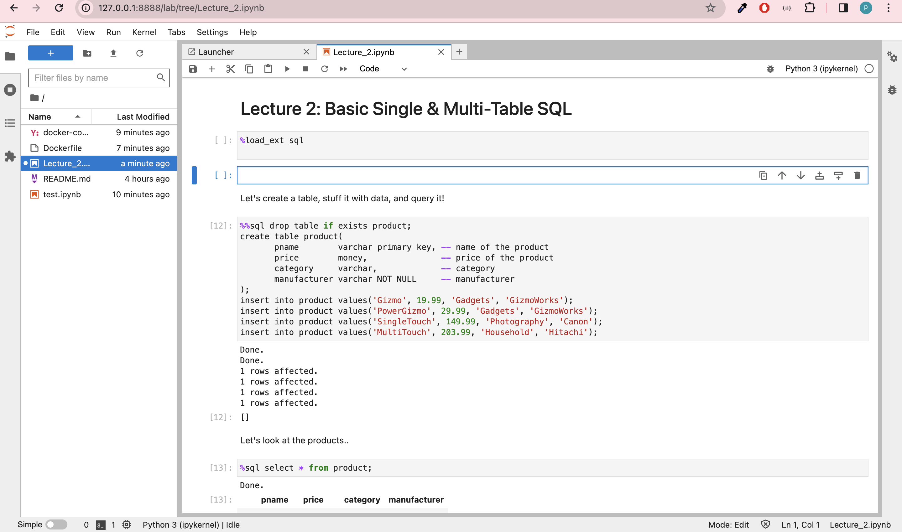

# What is the docker in simple words?

Docker is an open platform for developing, shipping, and running applications. Docker enables you to separate your applications from your infrastructure so you can deliver software quickly. With Docker, you can manage your infrastructure in the same ways you manage your applications.

To check if docker is running, type in the terminal

```cmd
docker ps
```

Above commands outputs all of the containers which are launched right now.


If you see just a header shown above - that's fine. It means you have installed docker correctly, just no containers are running right now.

To run the container and up your juptyter notebook we will use docker compose command.
# Docker Compose

The docker compose file is defined in the following way.
It includes the jupyter notebook and postgres db with credentials

```yml
version: "3.1"
services:
  jupyter:
    build:
      context: ./
      dockerfile: Dockerfile
    volumes:
      - ./:/lab1
    ports:
      - 8888:8888
  db:
    image: postgres:latest
    restart: always
    volumes:
      - pgdata:/var/lib/postgresql/data
    environment:
      POSTGRES_USER: postgres
      POSTGRES_PASSWORD: postgres
      POSTGRES_DB: postgres
    ports:
      - 5432:5432
volumes:
  pgdata:
```

The **Dockerfile** will include python libraries and other configurations :

```

# Use an official Jupyter image with Python as the base image
FROM jupyter/base-notebook:python-3.8
# Additional instructions to install required Python packages
RUN pip install pandas sqlalchemy ipython-sql numpy psycopg2-binary

# Set the working directory in the container
WORKDIR /lab1

# Copy the Jupyter notebook file to the container
COPY test.ipynb .

# Expose the port Jupyter runs on
EXPOSE 8888

```


To launch the container:(run this from the location where your docker-compose file is present)

```cmd
docker-compose up --build
```
# Opening Jupyter notebook
After running docker compose command you will see a url as shown in the image below. Paste the url in web browser or paste it after selecting jupyter kernel in vscode to open the jupyter notebook


After pasting the url in the browser you will be able to see your jupyter notebooks like this



# Connect the Databse in Jupyter notebook

Open/create the notebook in your container and enter and execute the following script:


```python
import sqlalchemy
%load_ext sql
%sql postgresql://postgres:postgres@db:5432/postgres
```

# How to get in your container 

While your container is running, open second terminal and enter the followng commnand:


What if i want to get into my container. For example, to install libraries to work with data, databases.

You need to enter in the second terminal(if you closed it after the previous command, just open the new one):

```cmd
docker exec -it <mycontainer> bash
```

```<mycontainer>``` is you ***container id***

# Without using Docker

Students who are facing difficulty in installing docker can use there local setup which will involve the following steps

- Installing and setting up PostgreSQL
- Creating a python environment

For Installing and Setting up PostgreSQL on local machine you can follow the links below

Download Postgres from the official website given below:
https://www.postgresql.org/download/

For Windows 
https://www.postgresqltutorial.com/postgresql-getting-started/install-postgresql/

Video: https://www.youtube.com/watch?v=IYHx0ovvxPs&ab_channel=ProgrammingKnowledge

For Macos:

Install Postgres app.
Follow the Instructions mentioned in the link below.
https://postgresapp.com/

If you dont have admin privilidges for your desktop then for adding path
create a .zshrc file if not present and add this path. After that you should be able to run psql from your terminal.
```cmd
export PATH=$PATH:/Applications/Postgres.app/Contents/Versions/16/bin
```


Creating a python environment

Setup python environment by installing ananconda or python. Refer to the links below.
https://docs.anaconda.com/free/anaconda/install/


